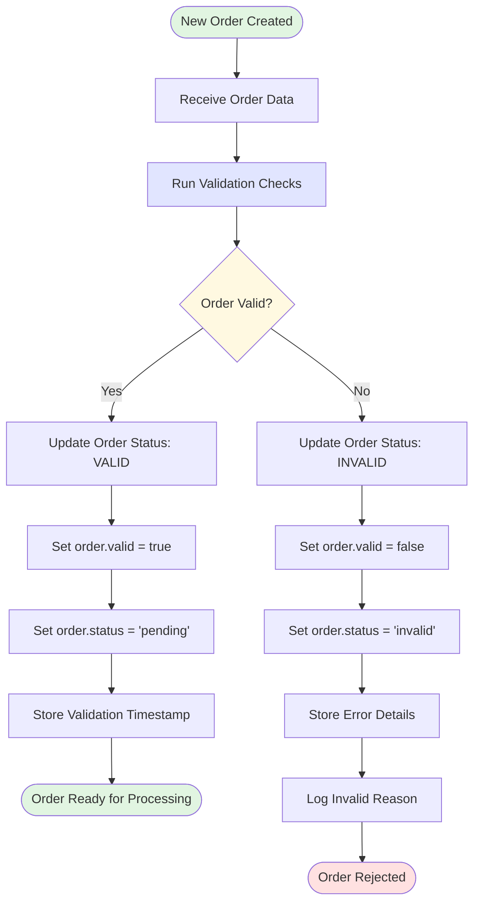
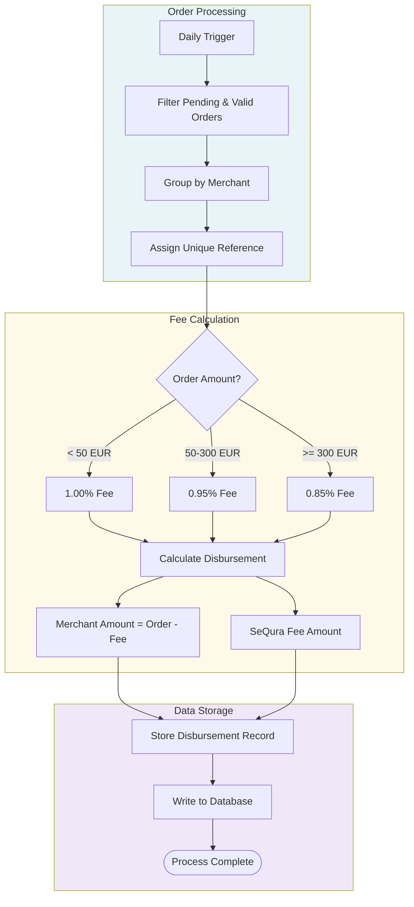
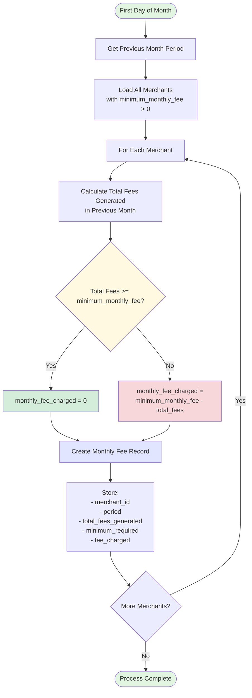

## Implementation plan

### Questions

* From where do we have live_on?
  * `DAILY` : every day, first one would be next day upon merchant creation
  * `WEEKLY` : I asume the first live_on could be 2 days upon merchant creaation(give the chance for a couple of payments) or the next day if that will make the logic more simple

### Comissions

For each order, calculate seQura’s commission fee based on the order amount:

1.00% for orders below 50 €.
0.95% for orders between 50 € and 300 €.
0.85% for orders of 300 € or more.

Commissions will be subtracted from the merchant order value gross of the current disbursement. 

Assumption the commition will be substracted when the platform pays the merchant.

Question: the flow in real life would be, a user comes to sequra and whats to buy a product in 3 installments

### Disbursement

* Daily scheduled rake task to process disbursements, process shuld finish by 8:00am UTC
  * proposal to start the proces at 12:00am UTC


### Monthly minimum fee
  * first day of the month check the if `minimum_monthly_fee` is reached. Check if at least `minimum_monthly_fee` amout was payed to SeQura
  * Calculations of `mininum_monthly_fee` 
    ```
      # monthly_payed_fees: total monthly fee 
      # this is the calculated rest amout to be payed in case the minimum_monthly_fee is not reached by the end of the month
      remaining_monthly_fee = max(0, minimum_monthly_fee - monthly_fees)
    ```


### Orders

  * What we receive in ordes.csv are not disbursement orders, this orders neeed to be processed
  * Any new order needs to be processed
  * filter for orders that needs to be processed]
  * store data processed, pending, failed

### Orders and disbursement flow

#### Order creation flow

Uded Claude for mermaid charts see https://claude.ai/share/a9db0111-b80c-4847-9f71-4eb913527800



#### Disbursement flow



#### Monthly minimum fee


